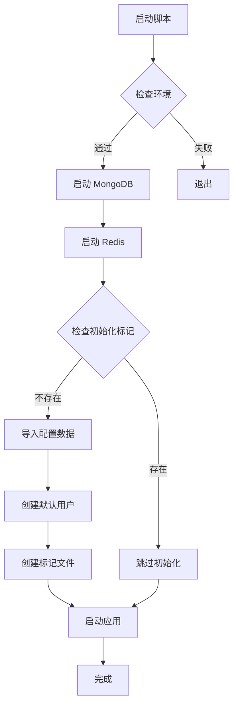
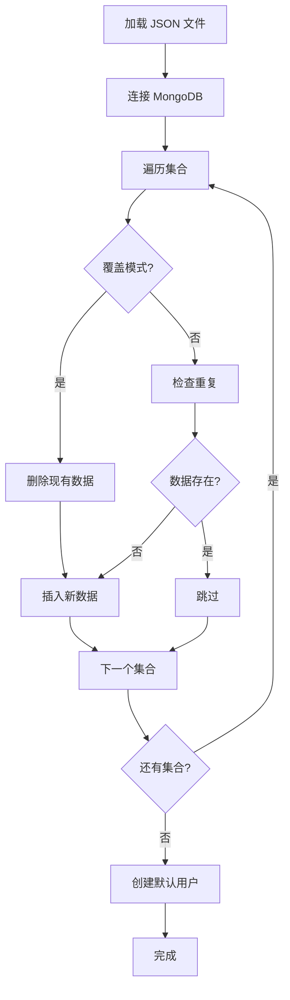

# TradingAgents-CN Pro - 数据库初始化解决方案

## 🎯 问题描述

v2.0 版本有很多新模块和数据库配置，如果没有这些配置，运行会有问题。

## ✅ 解决方案

### 方案概述

使用预导出的配置文件 `install/database_export_config_2025-11-13.json` 来初始化数据库。

---

## 📦 已创建的文件

### 1. 数据库初始化脚本

**文件**: `scripts/deployment/init_pro_database.ps1`

**功能**:
- ✅ 检查 MongoDB 服务状态
- ✅ 验证配置文件存在
- ✅ 导入配置数据到数据库
- ✅ 创建默认管理员账号
- ✅ 验证导入结果

**使用方法**:
```powershell
.\scripts\deployment\init_pro_database.ps1
```

---

### 2. 首次启动脚本

**文件**: `scripts/deployment/start_pro_first_time.ps1`

**功能**:
- ✅ 检查运行环境（Python、MongoDB、Redis）
- ✅ 启动数据库服务
- ✅ 自动初始化数据库（首次运行）
- ✅ 启动应用服务

**使用方法**:
```powershell
.\start_pro_first_time.ps1
```

**特性**:
- 自动检测是否已初始化（通过 `.db_initialized` 标记文件）
- 避免重复初始化
- 可以通过删除标记文件强制重新初始化

---

### 3. 配置文件说明文档

**文件**: `install/README_PRO.md`

**内容**:
- 📋 配置文件说明
- 🚀 使用方法（3种方式）
- 🔐 默认账号信息
- ⚙️ API 密钥配置指南
- 📊 预配置内容列表
- ❓ 常见问题解答

---

### 4. 同步脚本更新

**文件**: `scripts/deployment/sync_to_portable_pro.ps1`

**修改**:
- ✅ 添加 `install` 目录到同步列表
- ✅ 确保配置文件被打包到便携版

---

## 📊 配置文件内容

### `install/database_export_config_2025-11-13.json`

**大小**: ~14 MB  
**创建日期**: 2025-11-13

**包含的集合** (10个):

| 集合名称 | 说明 | 重要性 |
|---------|------|--------|
| `system_configs` | 系统配置 | ⭐⭐⭐ |
| `users` | 用户数据 | ⭐⭐⭐ |
| `llm_providers` | LLM 提供商配置 | ⭐⭐⭐ |
| `model_catalog` | 模型目录 | ⭐⭐⭐ |
| `market_categories` | 市场分类 | ⭐⭐ |
| `user_tags` | 用户标签 | ⭐ |
| `user_favorites` | 用户收藏 | ⭐ |
| `datasource_groupings` | 数据源分组 | ⭐⭐⭐ |
| `platform_configs` | 平台配置 | ⭐⭐ |
| `user_configs` | 用户配置 | ⭐⭐ |

---

## 🚀 使用流程

### 便携版用户（推荐）

```powershell
# 1. 解压便携版包
Expand-Archive TradingAgentsCN-Pro-Portable-1.0.0.zip

# 2. 进入目录
cd TradingAgentsCN-Pro-Portable-1.0.0

# 3. 运行首次启动脚本
.\start_pro_first_time.ps1

# 4. 访问 http://localhost
# 5. 使用默认账号登录: admin / admin123
```

### 开发者/高级用户

```powershell
# 方法 1: 使用初始化脚本
.\scripts\deployment\init_pro_database.ps1

# 方法 2: 直接使用导入脚本
python scripts\import_config_and_create_user.py `
    install\database_export_config_2025-11-13.json `
    --host --overwrite

# 方法 3: 只创建用户
python scripts\import_config_and_create_user.py `
    --create-user-only --host
```

---

## 🔄 工作流程

### 首次启动流程



### 数据导入流程



---

## ⚙️ 配置选项

### 初始化脚本参数

```powershell
# 指定 MongoDB 主机和端口
.\scripts\deployment\init_pro_database.ps1 `
    -MongoHost "localhost" `
    -MongoPort 27017

# 使用自定义配置文件
.\scripts\deployment\init_pro_database.ps1 `
    -ConfigFile "path\to\custom_config.json"
```

### 导入脚本参数

```powershell
# 覆盖模式（默认）
python scripts\import_config_and_create_user.py config.json --overwrite

# 增量模式（跳过已存在的数据）
python scripts\import_config_and_create_user.py config.json --incremental

# 指定要导入的集合
python scripts\import_config_and_create_user.py config.json `
    --collections system_configs llm_providers model_catalog

# 跳过创建用户
python scripts\import_config_and_create_user.py config.json --skip-user
```

---

## 🔐 安全说明

### 脱敏处理

配置文件已进行脱敏处理：
- ✅ 所有 API 密钥已清空
- ✅ 用户密码已重置
- ✅ 敏感信息已移除

### 首次登录后

⚠️ **重要**: 首次登录后请立即：
1. 修改默认管理员密码
2. 配置 LLM API 密钥
3. 配置数据源 API 密钥

---

## 📝 后续步骤

### 1. 配置 API 密钥

登录后进入 **系统管理** → **LLM 配置**，为以下模型配置 API 密钥：
- Google Gemini
- OpenAI GPT
- DeepSeek
- 通义千问

### 2. 配置数据源

进入 **系统管理** → **数据源配置**，配置：
- Tushare Token
- Alpha Vantage API Key
- Finnhub API Key

### 3. 测试系统

- 创建分析任务
- 测试数据同步
- 验证 LLM 调用

---

## ❓ 故障排除

### 问题 1: MongoDB 连接失败

**解决方案**:
```powershell
# 检查 MongoDB 进程
Get-Process mongod

# 手动启动 MongoDB
.\vendors\mongodb\bin\mongod.exe --dbpath .\data\mongodb
```

### 问题 2: 配置文件不存在

**解决方案**:
```powershell
# 检查文件
Test-Path install\database_export_config_2025-11-13.json

# 如果不存在，从备份恢复或重新导出
```

### 问题 3: 导入失败

**解决方案**:
```powershell
# 查看详细错误信息
python scripts\import_config_and_create_user.py config.json --host -v

# 尝试增量模式
python scripts\import_config_and_create_user.py config.json --host --incremental
```

---

## ✅ 验证清单

- [ ] MongoDB 服务正常运行
- [ ] Redis 服务正常运行
- [ ] 配置文件已导入
- [ ] 默认用户已创建
- [ ] 可以正常登录
- [ ] LLM 配置已加载
- [ ] 数据源配置已加载
- [ ] 市场分类已加载

---

**版权所有 © 2024-2025 TradingAgents-CN Pro Team**

