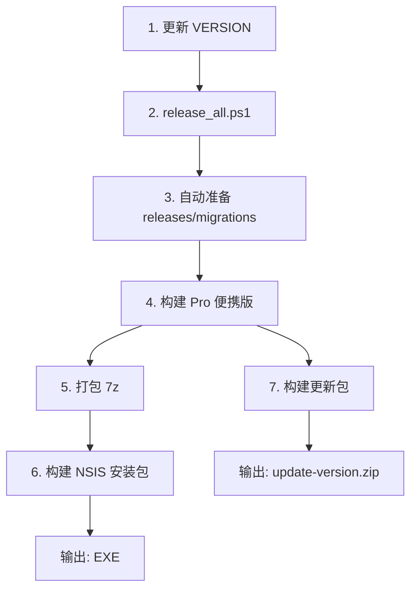

# TradingAgentsCN 发布流程

本文档描述版本发布的完整流程，包括准备内容、打包清单、检查步骤、工具说明及已知缺失项。

---

## 1. 概述与前置条件

### 1.1 环境要求

| 工具 | 用途 | 说明 |
|------|------|------|
| Git | 版本控制 | 发布前需工作区干净 |
| Node.js | 前端构建 | 用于 `frontend/` 的 Vite 构建 |
| Python 3.10 | 后端与脚本 | 项目运行环境 |
| NSIS | 安装包编译 | Nullsoft Scriptable Install System，自动检测或 `-NsisPath` 指定 |
| 7-Zip | 便携版压缩 | 构建便携版时使用 |

### 1.2 版本号来源

- **默认**：从项目根目录 `VERSION` 文件读取
- **覆盖**：构建脚本支持 `-Version "x.y.z"` 参数
- **BUILD_INFO**：若存在 `scripts/build/generate_build_info.ps1`，会生成 `BUILD_INFO`（含 build_date、git_commit、full_version 等）

### 1.3 生产基准（Production Baseline）

官网当前提供下载的版本作为基准：

| 项目 | 值 |
|------|-----|
| **版本** | 2.0.0 |
| **构建日期** | 2026-02-08 |
| **Git Commit** | `e73b8a8b` |
| **安装包** | `TradingAgentsCNSetup-2.0.0-build20260208-113504.exe` |
| **路径** | `release/packages/` |

`releases/2.0.0/` 目录已创建，作为版本对比和发布准备的基准。准备 2.0.1 及以上版本时，上一版本为 2.0.0。

---

## 2. 准备内容清单

发布新版本前，需完成以下准备：

| 类别 | 内容 | 路径/说明 |
|------|------|-----------|
| 版本号 | 更新 VERSION | 项目根目录 `VERSION` 文件 |
| 发布清单 | 创建 releases/{version}/ | 见 [releases/README.md](README.md) |
| manifest.json | 版本清单 | `releases/{version}/manifest.json`，含 migrations、upgrade_config、features 等 |
| upgrade_config.json | 升级配置增量 | `releases/{version}/upgrade_config.json`，仅包含该版本新增的模板/配置 |
| 迁移脚本 | 如有 schema 变更 | `migrations/v{version}.py`（手动创建，无自动生成脚本） |
| 变更记录 | 更新 CHANGELOG | `docs/releases/CHANGELOG.md` |
| 构建信息 | BUILD_INFO | 由 `generate_build_info.ps1` 生成（见 [7. 缺失项](#7-缺失项与待讨论)） |

### 2.1 发布清单示例

```text
releases/2.0.2/
├── manifest.json       # 版本、迁移、功能等
└── upgrade_config.json # 升级配置增量
```

---

## 3. 打包产物与包含内容

> 当前对外发布策略：**仅发布 Windows 安装包**。
> `release/TradingAgentsCN-portable`、便携版 ZIP、installer 7z 等仍可保留在构建链路中，但仅作为内部打包、安装包验证和更新包取源的中间产物，不再作为用户下载形态。

### 3.1 便携版（Pro Package）

**状态**：内部中间产物，不对外分发

**同步脚本**：`scripts/deployment/sync_to_portable_pro.ps1`

**同步目录**：core, app, tradingagents, examples, prompts, config, install, releases

**额外同步**：migrations（供升级包与迁移执行使用）

**同步文件**：VERSION, BUILD_INFO, requirements.txt, pyproject.toml, README.md, .env.example, start_api.py, debug_services.ps1

**排除**：`__pycache__`, `*.pyc`, `*.pyd`, `*.pyo`, `.pytest_cache`, `node_modules`, `.git`, 课程源码、设计文档等

**文档打包规则**：不再同步整个 `docs/` 目录；发布包中的 `docs/` 只能来自 `docs/release_v2.0/` 这一套面向最终用户的交付文档。

**学习中心例外规则**：学习中心文章不依赖安装包中的 `docs/` 目录。其内容来自前端构建时对 `docs/learning/`、`docs/paper/`、`docs/courses/advanced/expanded/` 的 `?raw` 导入，因此这些文档如有变更，必须重新构建前端后才能进入发布包。

**编译规则**：`core/`、`app/`、`tradingagents/`、`scripts/`、`migrations/` 在便携版阶段统一编译；除运行入口白名单外，不应保留 Python 源码。

**允许保留源码的运行入口**：`app/__main__.py`、`app/worker/__main__.py`、`scripts/apply_upgrade_config.py`、`scripts/import_config_and_create_user.py`、`scripts/import_mongodb_config.py`、`scripts/init_mongodb_user.py`、`scripts/installer/start_all.py`、`scripts/monitor/process_monitor.py`、`scripts/monitor/tray_monitor.py`、`migrations/__main__.py`、`migrations/cli.py`

**便携版专属**（不同步，保留便携版中已有内容）：.env, data, logs, temp, runtime, vendors, frontend（使用 dist）, start_all.ps1, stop_all.ps1 等

**输出**：`release/packages/TradingAgentsCN-Pro-Portable-{VERSION}-{TIMESTAMP}.zip`

### 3.2 安装包（NSIS Installer）

**状态**：唯一对外发布的 Windows 桌面产物

**基于**：便携版 7z 包（`release/packages/TradingAgentsCN-Portable-latest-installer.7z`）

**构建输出**：`release/packages/TradingAgentsCNSetup-{VERSION}-build{TIMESTAMP}.exe`

**归档输出**：`D:/release/{VERSION}/revNNN/TradingAgentsCNSetup-{VERSION}-build{TIMESTAMP}.exe`

**特性**：端口配置 UI、端口冲突检测、桌面/开始菜单快捷方式、卸载程序

### 3.3 更新包（Update Package）

**状态**：仅供已安装客户端应用内升级使用，不面向用户手工下载页面作为主安装入口

**脚本**：`scripts/deployment/build_update_package.ps1`

**源码保护要求**：更新包必须从 `release/TradingAgentsCN-portable` 这一份已编译产物取源；如果便携目录缺失或关键代码目录缺失，应直接失败，不能回退到项目根目录打入原始 `.py` 源码。

**当前包含**：app, core, frontend, scripts, tradingagents, prompts, migrations, releases, install, config, VERSION, BUILD_INFO

**构建输出**：`release/packages/update-{VERSION}.zip` + `update-{VERSION}.sha256`

**归档输出**：`D:/release/{VERSION}/revNNN/update-{VERSION}.zip` + `update-{VERSION}.sha256`

**注意**：当前更新包**已包含** `releases`、`install`、`config`，升级安装可以获得新版本的 upgrade_config 与发布元数据；更新器替换清单也必须同步覆盖这些目录。

---

## 4. 构建流程

### 4.1 一键发布（推荐）

开发测试完成后，执行一条命令即可完成全部打包：

```powershell
.\scripts\deployment\release_all.ps1
```

该脚本会自动：

1. 从 VERSION 文件读取版本号
2. 若 `releases/{version}/` 不存在，自动创建 manifest.json、upgrade_config.json
3. 若 `migrations/v{version}.py` 不存在，自动创建模板
4. 生成 BUILD_INFO
5. 构建 Pro 便携版、7z 包、NSIS 安装包、更新包

> 构建过程仍以 `release/packages/` 作为中间输出目录，方便 NSIS 和更新包脚本互相取源。
> 正式留档与上传目录统一为 `D:/release/{VERSION}/revNNN/`。每次打包自动递增 `revNNN` 子版本号，便于核对每一轮发布尝试。

### 4.3 归档目录规范

- 归档根目录：`D:/release`
- 版本目录：`D:/release/{VERSION}`，例如 `D:/release/2.0.1`
- 子版本目录：`rev001`、`rev002`、`rev003` 依次递增

每个 `revNNN` 目录至少包含：

- 安装包
- 更新包与 `.sha256`
- `BUILD_INFO-{full_version}.json`
- `manifest-{VERSION}.json`
- `TradingAgentsCN-source-{full_version}.zip`
- `git_release_info.json`
- `GIT_COMMIT_INFO.txt`
- `GIT_STATUS.txt`
- `RELEASE_UPLOAD_INFO.md`
- `release_metadata.json`

其中 `RELEASE_UPLOAD_INFO.md` 会自动写入网站后台需要的关键字段：

- 安装包字节数
- 升级包字节数
- SHA256
- 推荐下载地址
- 可直接复制的后端 JSON 草稿

同时每次归档都应绑定一个 git tag，推荐格式：`v{VERSION}-revNNN`。

例如：

- `v2.0.1-rev001`
- `v2.0.1-rev002`

这样同一个语义版本下的多次重新打包，也能分别对应到各自的代码留档和归档目录。

**参数**：

- `-Version "x.y.z"`：覆盖 VERSION 文件中的版本号
- `-SkipInstaller`：跳过 NSIS 安装包，仅构建便携版和更新包
- `-SkipPrepare`：跳过自动创建 releases/、migrations/，使用已有文件

### 4.2 流程图



### 4.3 分步命令（高级）

如需分步执行：

```powershell
# 1. 更新版本号（手动编辑 VERSION 文件）

# 2. 一键发布
.\scripts\deployment\release_all.ps1

# 或分步：
.\scripts\deployment\build_pro_package.ps1
.\scripts\windows-installer\build\build_installer.ps1 -SkipPortablePackage
.\scripts\deployment\build_update_package.ps1
```

---

## 5. 检查与验证

发布前建议执行以下检查：

| 检查项 | 脚本/方法 |
|--------|-----------|
| 版本一致性 | `python utils/check_version_consistency.py`（检查 VERSION、pyproject.toml、README 等） |
| 便携版依赖 | `.\scripts\deployment\verify_portable_dependencies.ps1` |
| prompts 完整性 | `.\scripts\deployment\verify_prompts_in_portable.ps1` |
| 升级配置 | 手动确认 `releases/{version}/upgrade_config.json` 存在且格式正确 |
| 迁移脚本 | 手动确认 `migrations/v{version}.py` 存在且可导入（`python -m migrations.cli status`） |
| 更新器替换清单 | 手动确认 `scripts/updater/apply_update.ps1` 的替换项与 `build_update_package.ps1` 的打包项一致 |

---

## 6. 工具说明

| 工具 | 用途 | 路径 |
|------|------|------|
| **release_all.ps1** | **一键发布**（推荐） | `scripts/deployment/` |
| generate_build_info.ps1 | 生成 BUILD_INFO | `scripts/build/` |
| sync_to_portable_pro.ps1 | Pro 版同步 | `scripts/deployment/` |
| build_pro_package.ps1 | Pro 版完整构建 | `scripts/deployment/` |
| build_portable_package.ps1 | 便携版打包（含格式选项） | `scripts/deployment/` |
| build_installer.ps1 | 安装包构建 | `scripts/windows-installer/build/` |
| build_update_package.ps1 | 更新包构建 | `scripts/deployment/` |
| apply_upgrade_config.py | 升级配置导入 | `scripts/`（升级安装后首次启动时调用） |

### 6.1 NSIS

- **安装**：从 [NSIS 官网](https://nsis.sourceforge.io/) 下载安装
- **检测**：构建脚本自动检测标准路径，或通过 `-NsisPath` 指定

### 6.2 7-Zip

- 便携版构建时用于压缩，需已安装 7-Zip

---

## 7. 缺失项与待讨论

以下为当前已知缺失或待完善项，发布时需注意：

### 7.1 generate_build_info.sh（Docker 用）

- **状态**：`scripts/build/generate_build_info.ps1` 已存在，`generate_build_info.sh` 供 Docker 构建使用，若缺失则 Docker 构建时仅打印警告

### 7.2 更新包已包含 releases、install、config

- **状态**：已修复，`build_update_package.ps1` 已包含 releases、install、config

### 7.3 迁移脚本自动生成

- **状态**：`release_all.ps1` 会自动创建 `migrations/v{version}.py` 模板（若不存在）
- 若有 schema 变更，需手动编辑该文件补充迁移逻辑

### 7.4 版本一致性检查

- **状态**：`utils/check_version_consistency.py` 存在
- **建议**：将 `python utils/check_version_consistency.py` 纳入发布前检查清单（已列入本文档第 5 节）

---

## 8. 相关文档

- [releases/README.md](README.md) - 版本发布目录结构与 manifest 说明
- [install/README_UPGRADE_CONFIG.md](../install/README_UPGRADE_CONFIG.md) - 升级配置说明
- [.augment/rules/deployment_packaging.md](../.augment/rules/deployment_packaging.md) - 三种打包方式详解
- [scripts/windows-installer/README.md](../scripts/windows-installer/README.md) - 安装包构建说明
- [docs/releases/CHANGELOG.md](../docs/releases/CHANGELOG.md) - 变更记录
